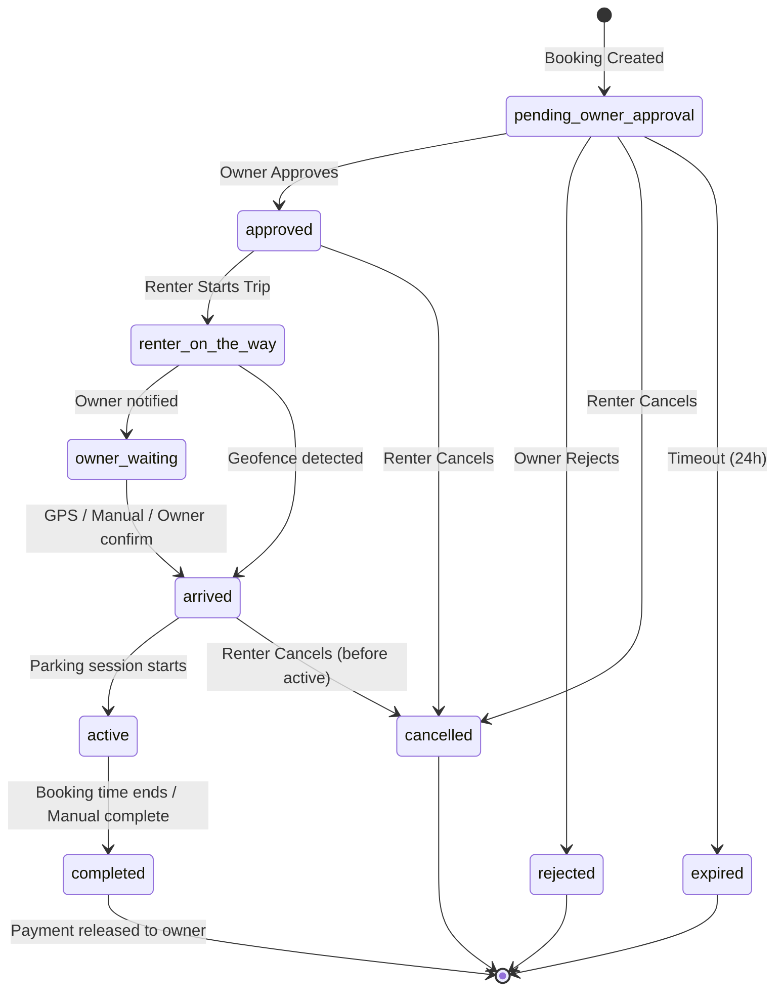
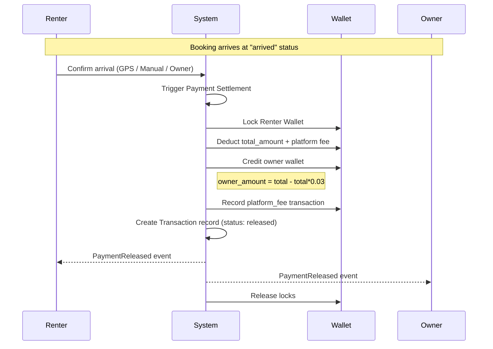

# Marketplace Rental Flow — Архитектурный план миграции

## 1. Обзор задачи

Миграция существующей системы **Parking + Offer + Booking** на полноценную **Marketplace Rental Flow** архитектуру.

**Существующая архитектура:**
- [`Parking`](backend/app/Models/Parking.php) — статический parking с slot-based моделью
- [`Booking`](backend/app/Models/Booking.php) — простая бронь с parking_id, 5 статусов
- [`Offer`](backend/app/Models/Offer.php) — P2P ценовое предложение между пользователями
- [`User`](backend/app/Models/User.php) — 3 роли (admin/owner/user)
- Репозитории, Сервисы, Дто, Events (Pusher), Ресурсы

**Целевая архитектура:**
- `ParkingOffer` — маркетплейс-слой поверх существующего Parking
- Расширенный Booking lifecycle (10 статусов)
- Live Location Sharing с геозоной arrival detection
- Wallet & Escrow Payment System (3% платформа)
- Dual-sided Rating System
- Realtime Events (Laravel Echo + Pusher/WebSocket)

---

## 2. Структура проекта — новые/изменяемые файлы

### 2.1 Backend (Laravel) — новые файлы

```
backend/
├── app/
│   ├── Enums/
│   │   ├── BookingStatus.php              # ✏️ РАСШИРИТЬ (добавить 5 новых статусов)
│   │   ├── ParkingOfferStatus.php          # 🆕 draft, active, paused, booked, completed, blocked
│   │   ├── ParkingType.php                 # 🆕 private, municipal
│   │   ├── WalletTransactionType.php       # 🆕 deposit, withdrawal, booking_payment, booking_income, platform_fee, refund
│   │   ├── WalletTransactionStatus.php     # 🆕 pending, completed, failed
│   │   ├── TransactionStatus.php           # 🆕 held, released, refunded
│   │   └── LiveLocationEvent.php           # 🆕
│   ├── Models/
│   │   ├── ParkingOffer.php                # 🆕 Main marketplace model
│   │   ├── OfferImage.php                  # 🆕 Photos for offer
│   │   ├── OfferAvailability.php           # 🆕 Time-based recurring availability
│   │   ├── Wallet.php                      # 🆕 User wallet
│   │   ├── WalletTransaction.php           # 🆕 Wallet ledger
│   │   ├── Transaction.php                 # 🆕 Escrow payment transaction
│   │   ├── Rating.php                      # 🆕 Dual-sided rating
│   │   └── LiveLocation.php                # 🆕 Real-time GPS tracking
│   ├── Services/
│   │   ├── ParkingOffer/
│   │   │   └── ParkingOfferService.php     # 🆕 Offer CRUD, pause/activate
│   │   ├── Payment/
│   │   │   ├── WalletService.php           # 🆕 Wallet operations
│   │   │   ├── PaymentService.php          # 🆕 Escrow/release/refund
│   │   │   └── PaymentSettlementService.php# 🆕 Settlement logic with 3% fee
│   │   ├── Location/
│   │   │   └── LiveLocationService.php     # 🆕 Location tracking, geofence
│   │   ├── Rating/
│   │   │   └── RatingService.php           # 🆕 Dual rating logic
│   │   └── Booking/
│   │       ├── BookingService.php          # ✏️ РАСШИРИТЬ (новые статусы, offer_id)
│   │       └── BookingLifecycleService.php # 🆕 Полный lifecycle management
│   ├── Http/
│   │   ├── Controllers/API/
│   │   │   ├── ParkingOfferController.php  # 🆕 Offers CRUD + pause/activate
│   │   │   ├── WalletController.php        # 🆕 Wallet + deposit/withdraw
│   │   │   ├── RatingController.php        # 🆕 Submit ratings
│   │   │   ├── LiveLocationController.php  # 🆕 Location sharing
│   │   │   └── BookingController.php       # ✏️ РАСШИРИТЬ (новые endpoints)
│   │   ├── Requests/
│   │   │   ├── ParkingOffer/
│   │   │   │   ├── StoreParkingOfferRequest.php    # 🆕
│   │   │   │   └── UpdateParkingOfferRequest.php    # 🆕
│   │   │   ├── Payment/
│   │   │   │   ├── DepositRequest.php         # 🆕
│   │   │   │   └── WithdrawRequest.php        # 🆕
│   │   │   └── Rating/
│   │   │       └── StoreRatingRequest.php     # 🆕
│   │   └── Resources/
│   │       ├── ParkingOfferResource.php       # 🆕
│   │       ├── WalletResource.php             # 🆕
│   │       ├── WalletTransactionResource.php  # 🆕
│   │       ├── RatingResource.php             # 🆕
│   │       └── LiveLocationResource.php       # 🆕
│   ├── Events/
│   │   ├── BookingRequestReceived.php         # 🆕
│   │   ├── BookingRejected.php                # 🆕
│   │   ├── RenterStartedTrip.php              # 🆕
│   │   ├── UsersLocationUpdated.php           # 🆕
│   │   ├── RenterArrived.php                  # 🆕
│   │   ├── PaymentReleased.php                # 🆕
│   │   └── RatingSubmitted.php                # 🆕
│   ├── Listeners/
│   │   ├── HandleBookingApproved.php          # 🆕 Start live session
│   │   ├── HandleRenterArrived.php            # 🆕 Trigger payment escrow
│   │   └── HandleBookingCompleted.php         # 🆕 Finalize payment release
│   ├── Jobs/
│   │   ├── ExpirePendingBookings.php          # 🆕 Scheduled job
│   │   ├── ReleasePendingPayments.php         # 🆕 Scheduled job
│   │   └── CleanupExpiredLiveLocations.php    # 🆕 Scheduled job
│   └── Exceptions/
│       ├── InsufficientBalanceException.php   # 🆕
│       ├── PaymentFailedException.php         # 🆕
│       └── GeoFenceBreachException.php        # 🆕
├── database/
│   ├── migrations/
│   │   ├── 2026_05_10_000001_create_parking_offers_table.php       # 🆕
│   │   ├── 2026_05_10_000002_create_offer_images_table.php          # 🆕
│   │   ├── 2026_05_10_000003_create_offer_availability_table.php    # 🆕
│   │   ├── 2026_05_10_000004_create_wallets_table.php               # 🆕
│   │   ├── 2026_05_10_000005_create_wallet_transactions_table.php   # 🆕
│   │   ├── 2026_05_10_000006_create_transactions_table.php          # 🆕
│   │   ├── 2026_05_10_000007_create_ratings_table.php               # 🆕
│   │   ├── 2026_05_10_000008_create_live_locations_table.php        # 🆕
│   │   ├── 2026_05_10_000009_add_parking_offer_id_to_bookings.php  # 🆕
│   │   ├── 2026_05_10_000010_add_rating_fields_to_users.php        # 🆕
│   │   └── 2026_05_10_000011_add_rejection_reason_to_bookings.php  # 🆕
│   └── seeders/
│       └── MarketplaceSeeder.php             # 🆕 Demo seed data
├── routes/
│   └── api.php                                # ✏️ РАСШИРИТЬ новые endpoints
└── tests/
    └── Feature/
        ├── ParkingOfferTest.php               # 🆕
        ├── WalletTransactionTest.php          # 🆕
        ├── RaceConditionTest.php              # 🆕 РАСШИРИТЬ
        ├── BookingLifecycleTest.php           # 🆕
        ├── ArrivalDetectionTest.php           # 🆕
        ├── LiveLocationTest.php               # 🆕
        └── RatingPermissionTest.php           # 🆕
```

### 2.2 User Frontend — новые/изменяемые файлы

```
user/src/
├── app/
│   ├── (marketplace)/
│   │   ├── create-offer/
│   │   │   └── page.tsx                      # 🆕 Create Parking Offer page
│   │   ├── offer/[id]/
│   │   │   └── page.tsx                      # 🆕 Offer detail + gallery + calendar
│   │   ├── wallet/
│   │   │   └── page.tsx                      # 🆕 Wallet + transactions
│   │   ├── live-tracking/
│   │   │   └── [bookingId]/
│   │   │       └── page.tsx                  # 🆕 Live tracking map
│   │   └── owner-profile/
│   │       └── [userId]/
│   │           └── page.tsx                  # 🆕 Owner public profile
│   └── my-offers/
│       └── page.tsx                          # ✏️ РАСШИРИТЬ (manage offers)
├── components/
│   ├── offer/
│   │   ├── OfferForm.tsx                     # 🆕 Offer creation form
│   │   ├── OfferCard.tsx                     # 🆕 Offer card component
│   │   ├── OfferGallery.tsx                  # 🆕 Photo gallery with upload
│   │   ├── OfferCalendar.tsx                 # 🆕 Availability calendar
│   │   ├── OfferMapPicker.tsx                # 🆕 Map pin picker
│   │   └── OfferFeaturesSelector.tsx         # 🆕 Features/amenities selector
│   ├── booking/
│   │   ├── OwnerApprovalSheet.tsx            # 🆕 Owner approval/reject UI
│   │   ├── BookingStateBadge.tsx             # 🆕 State display for new statuses
│   │   └── ArrivalConfirmationButton.tsx     # 🆕 Manual arrival button
│   ├── map/
│   │   └── LiveTrackingMap.tsx               # 🆕 Real-time location map
│   ├── wallet/
│   │   ├── WalletBalance.tsx                 # 🆕 Balance display
│   │   ├── TransactionList.tsx               # 🆕 Transaction history
│   │   └── DepositDialog.tsx                 # 🆕 Deposit funds
│   ├── rating/
│   │   ├── RatingDialog.tsx                  # 🆕 Submit rating
│   │   ├── RatingStars.tsx                   # 🆕 Star display
│   │   └── RatingList.tsx                    # 🆕 Rating list with comments
│   └── ui/
│       └── ImageUploader.tsx                 # 🆕 Multi-image upload with thumbnails
├── hooks/
│   ├── useParkingOffers.ts                   # 🆕 Offers queries
│   ├── useWallet.ts                          # 🆕 Wallet queries
│   ├── useLiveLocation.ts                    # 🆕 Live location hook
│   └── useGeofence.ts                        # 🆕 Geofence detection
├── services/
│   ├── parkingOffers.ts                      # 🆕 Offer API service
│   ├── wallet.ts                             # 🆕 Wallet API service
│   ├── ratings.ts                            # 🆕 Rating API service
│   ├── liveLocation.ts                       # 🆕 Location API service
│   ├── booking.ts                            # ✏️ РАСШИРИТЬ (new endpoints)
│   └── realtime.tsx                          # ✏️ РАСШИРИТЬ (new event listeners)
├── store/
│   ├── offerStore.ts                         # 🆕 Offer state
│   ├── walletStore.ts                        # 🆕 Wallet state
│   └── liveLocationStore.ts                  # 🆕 Live location state
└── types/
    └── index.ts                              # ✏️ РАСШИРИТЬ (new types)
```

### 2.3 Admin Panel — новые/изменяемые файлы

```
admin/src/
├── app/
│   ├── parking-offers/
│   │   ├── layout.tsx                        # 🆕
│   │   └── page.tsx                          # 🆕 Manage offers
│   ├── wallets/
│   │   ├── layout.tsx                        # 🆕
│   │   └── page.tsx                          # 🆕 Manage wallets
│   ├── transactions/
│   │   ├── layout.tsx                        # 🆕
│   │   └── page.tsx                          # 🆕 Transaction management
│   ├── ratings/
│   │   ├── layout.tsx                        # 🆕
│   │   └── page.tsx                          # 🆕 Rating management
│   └── live-sessions/
│       ├── layout.tsx                        # 🆕
│       └── page.tsx                          # 🆕 Live booking monitoring
├── components/
│   ├── wallet/
│   │   ├── FreezeWalletDialog.tsx            # 🆕
│   │   └── RefundDialog.tsx                  # 🆕
│   └── offers/
│       └── BlockOfferDialog.tsx              # 🆕
├── features/
│   ├── parking-offers/                       # 🆕
│   ├── wallets/                              # 🆕
│   ├── transactions/                         # 🆕
│   └── live-sessions/                        # 🆕
├── hooks/
│   └── use-admin-realtime.ts                 # 🆕 Admin realtime events
├── services/
│   └── api.ts                                # ✏️ РАСШИРИТЬ (new admin endpoints)
└── types/
    └── index.ts                              # ✏️ РАСШИРИТЬ (new admin types)
```

---

## 3. Модели данных

### 3.1 ✅ Existing — `Parking` (НЕ ТРОГАТЬ)
Существующая модель [`Parking`](backend/app/Models/Parking.php) остаётся без изменений для обратной совместимости.

### 3.2 🆕 `ParkingOffer`

```php
// parking_offers table
- id
- owner_id (FK -> users)
- parking_id (FK -> parkings, nullable — transitional compat)
- title
- description
- parking_type (enum: private, municipal)
- address
- latitude (decimal 10,7)
- longitude (decimal 10,7)
- supported_vehicle_sizes (json) // ['sedan','suv','large_suv','van']
- features (json) // ['covered','cameras','security_guard','gated','charging_station']
- hourly_price (decimal 10,2)
- minimum_hours (integer, default 1)
- available_from (time, nullable)
- available_until (time, nullable — mandatory for private)
- is_active (boolean)
- status (enum: draft, active, paused, booked, completed, blocked)
- average_rating (decimal 2,1, default 0)
- total_reviews (integer, default 0)
- created_at, updated_at
```

**Relationships:**
- `owner()` -> `User`
- `parking()` -> `Parking` (nullable, transitional)
- `images()` -> `OfferImage` (hasMany)
- `availability()` -> `OfferAvailability` (hasMany)
- `bookings()` -> `Booking` (hasMany through parking_offer_id)

### 3.3 🆕 `OfferImage`

```php
// offer_images table
- id
- offer_id (FK -> parking_offers, cascade)
- image_path (string)
- sort_order (integer, default 0)
- created_at
```

### 3.4 🆕 `OfferAvailability`

```php
// offer_availability table
- id
- offer_id (FK -> parking_offers, cascade)
- day_of_week (integer, nullable — null = specific date)
- specific_date (date, nullable)
- from_time (time)
- until_time (time)
- is_available (boolean, default true)
- created_at, updated_at
```

### 3.5 🆕 `Wallet`

```php
// wallets table
- id
- user_id (FK -> users, unique)
- balance (decimal 12,2, default 0)
- currency (string, default 'GEL')
- is_blocked (boolean, default false)
- created_at, updated_at
```

### 3.6 🆕 `WalletTransaction`

```php
// wallet_transactions table
- id
- wallet_id (FK -> wallets)
- type (enum: deposit, withdrawal, booking_payment, booking_income, platform_fee, refund)
- amount (decimal 12,2)
- balance_before (decimal 12,2)
- balance_after (decimal 12,2)
- reference_type (string, nullable) // 'booking', 'deposit', 'withdrawal'
- reference_id (integer, nullable)
- status (enum: pending, completed, failed)
- description (text, nullable)
- created_at
```

### 3.7 🆕 `Transaction` (Escrow)

```php
// transactions table
- id
- booking_id (FK -> bookings)
- renter_id (FK -> users)
- owner_id (FK -> users)
- total_amount (decimal 12,2)
- platform_fee (decimal 12,2)
- owner_amount (decimal 12,2)
- status (enum: held, released, refunded, failed)
- held_at (datetime)
- released_at (datetime, nullable)
- refunded_at (datetime, nullable)
- created_at, updated_at
```

### 3.8 🆕 `Rating`

```php
// ratings table
- id
- booking_id (FK -> bookings)
- from_user_id (FK -> users)
- to_user_id (FK -> users)
- rating (integer, 1-5)
- comment (text, nullable)
- created_at

Index: unique(booking_id, from_user_id, to_user_id) — one rating per direction per booking
```

### 3.9 🆕 `LiveLocation`

```php
// live_locations table
- id
- booking_id (FK -> bookings)
- user_id (FK -> users)
- latitude (decimal 10,7)
- longitude (decimal 10,7)
- heading (float, nullable)
- speed (float, nullable)
- updated_at (datetime, indexed)
```

### 3.10 ✏️ `Booking` — расширение

```php
// Existing fields +
// New columns:
- parking_offer_id (FK -> parking_offers, nullable — transitional)
- user_car_id (FK -> user_cars) // уже добавлено
- rejection_reason (text, nullable) // если owner reject
- approved_at (datetime, nullable)
- started_at (datetime, nullable) // когда renter начал поездку
- arrived_at (datetime, nullable) // когда arrived
- completed_at (datetime, nullable)

// New booking_status values:
pending_owner_approval, approved, renter_on_the_way, owner_waiting,
arrived, active, completed, rejected, cancelled, expired
```

### 3.11 ✏️ `User` — расширение

```php
// New columns:
- average_rating (decimal 2,1, default 0.0)
- total_reviews (integer, default 0)
```

---

## 4. Диаграмма Booking Lifecycle



---

## 5. Payment Flow (Escrow)



---

## 6. Realtime Events — полный список

| Event | Channel | Payload |
|-------|---------|---------|
| 🆕 `BookingRequestReceived` | `owner.{ownerId}` | renter_name, vehicle, rating, trips_count, estimated_arrival |
| ✏️ `BookingApproved` | `user.{userId}`, `owner.{ownerId}` | booking_id, status, parking_offer_id |
| 🆕 `BookingRejected` | `user.{userId}` | booking_id, rejection_reason |
| 🆕 `RenterStartedTrip` | `owner.{ownerId}` | booking_id, renter_location |
| 🆕 `UsersLocationUpdated` | `booking.{bookingId}` | user_id, lat, lng, heading, speed |
| 🆕 `RenterArrived` | `user.{userId}`, `owner.{ownerId}` | booking_id, arrival_method |
| 🆕 `PaymentReleased` | `user.{userId}`, `owner.{ownerId}` | transaction_id, amount |
| 🆕 `RatingSubmitted` | `user.{userId}`, `owner.{ownerId}` | booking_id, rating |

---

## 7. API Endpoints

### 7.1 Parking Offers

| Method | Endpoint | Description |
|--------|----------|-------------|
| `GET` | `/parking-offers` | List active offers (with filters: nearby, price, features) |
| `POST` | `/parking-offers` | Create offer |
| `GET` | `/parking-offers/{id}` | Offer details + images + availability |
| `PUT` | `/parking-offers/{id}` | Update offer (owner only) |
| `DELETE` | `/parking-offers/{id}` | Delete offer (owner only) |
| `POST` | `/parking-offers/{id}/pause` | Pause offer |
| `POST` | `/parking-offers/{id}/activate` | Activate offer |
| `GET` | `/my-parking-offers` | Current user's offers |

### 7.2 Bookings (Extended)

| Method | Endpoint | Description |
|--------|----------|-------------|
| `POST` | `/bookings` | Create booking (now accepts `parking_offer_id`) |
| `POST` | `/bookings/{id}/approve` | Owner approves |
| `POST` | `/bookings/{id}/reject` | Owner rejects (with reason) |
| `POST` | `/bookings/{id}/start-trip` | Renter starts trip |
| `POST` | `/bookings/{id}/arrived` | Confirm arrival |
| `POST` | `/bookings/{id}/complete` | Complete booking |

### 7.3 Live Location

| Method | Endpoint | Description |
|--------|----------|-------------|
| `POST` | `/bookings/{id}/location` | Update user location |
| `GET` | `/bookings/{id}/live-map` | Get both users' locations |

### 7.4 Wallet & Payments

| Method | Endpoint | Description |
|--------|----------|-------------|
| `GET` | `/wallet` | Get wallet balance |
| `POST` | `/wallet/deposit` | Deposit funds |
| `POST` | `/wallet/withdraw` | Withdraw funds |
| `GET` | `/wallet/transactions` | Transaction history |

### 7.5 Ratings

| Method | Endpoint | Description |
|--------|----------|-------------|
| `POST` | `/bookings/{id}/rate` | Submit rating |
| `GET` | `/users/{id}/ratings` | Get user's ratings |

---

## 8. План выполнения (Todo List)

### Этап 1: Database — миграции
1. Создать миграцию `parking_offers` table
2. Создать миграцию `offer_images` table
3. Создать миграцию `offer_availability` table
4. Создать миграцию `wallets` table
5. Создать миграцию `wallet_transactions` table
6. Создать миграцию `transactions` (escrow) table
7. Создать миграцию `ratings` table
8. Создать миграцию `live_locations` table
9. Создать миграцию `add_parking_offer_id_to_bookings`
10. Создать миграцию `add_rating_fields_to_users`
11. Создать миграцию `add_rejection_reason_to_bookings`

### Этап 2: Backend — Enums
12. Создать `ParkingOfferStatus` enum
13. Создать `ParkingType` enum
14. Создать `WalletTransactionType` enum
15. Создать `WalletTransactionStatus` enum
16. Создать `TransactionStatus` enum
17. Расширить `BookingStatus` (добавить 5 новых статусов)

### Этап 3: Backend — Models
18. Создать `ParkingOffer` model (with relationships)
19. Создать `OfferImage` model
20. Создать `OfferAvailability` model
21. Создать `Wallet` model (with balance locking)
22. Создать `WalletTransaction` model
23. Создать `Transaction` model (escrow)
24. Создать `Rating` model
25. Создать `LiveLocation` model
26. Расширить `User` model (average_rating, total_reviews, wallet, offers relationships)
27. Расширить `Booking` model (parking_offer_id, новые статусы, новые методы lifecycle)

### Этап 4: Backend — Services
28. Создать `ParkingOfferService` (CRUD + pause/activate)
29. Создать `WalletService` (deposit, withdraw, balance check, pessimistic locking)
30. Создать `PaymentService` (escrow hold, release, refund)
31. Создать `PaymentSettlementService` (3% fee calculation)
32. Создать `LiveLocationService` (update, get, geofence detection)
33. Создать `RatingService` (submit, validate permissions, update averages)
34. Создать `BookingLifecycleService` (state machine transitions)
35. Расширить `BookingService` (offer_id support, новые статусы)

### Этап 5: Backend — Events & Listeners
36. Создать `BookingRequestReceived` event
37. Создать `BookingRejected` event
38. Создать `RenterStartedTrip` event
39. Создать `UsersLocationUpdated` event
40. Создать `RenterArrived` event
41. Создать `PaymentReleased` event
42. Создать `RatingSubmitted` event
43. Создать `HandleBookingApproved` listener (start live session)
44. Создать `HandleRenterArrived` listener (trigger payment escrow)
45. Создать `HandleBookingCompleted` listener (finalize payment release)

### Этап 6: Backend — Controllers & Routes
46. Создать `ParkingOfferController` (full REST)
47. Создать `WalletController`
48. Создать `RatingController`
49. Создать `LiveLocationController`
50. Расширить `BookingController` (approve, reject, start-trip, arrived, complete)
51. Обновить `routes/api.php` (новые endpoints)

### Этап 7: Backend — Requests, Resources, Jobs
52. Создать `StoreParkingOfferRequest`, `UpdateParkingOfferRequest`
53. Создать `DepositRequest`, `WithdrawRequest`
54. Создать `StoreRatingRequest`
55. Создать `ParkingOfferResource`, `WalletResource`, `WalletTransactionResource`, `RatingResource`, `LiveLocationResource`
56. Создать scheduled jobs (ExpirePendingBookings, ReleasePendingPayments, CleanupExpiredLiveLocations)

### Этап 8: User Frontend — Types & Services
57. Расширить `types/index.ts` (ParkingOffer, Wallet, Transaction, Rating, LiveLocation, новые BookingStatus)
58. Создать `services/parkingOffers.ts`
59. Создать `services/wallet.ts`
60. Создать `services/ratings.ts`
61. Создать `services/liveLocation.ts`
62. Расширить `services/booking.ts` (новые endpoints)
63. Расширить `services/realtime.tsx` (новые event listeners)

### Этап 9: User Frontend — Components
64. Создать `OfferForm.tsx` (location picker, type, features, vehicle sizes, availability, pricing, media)
65. Создать `OfferCard.tsx` (offer display)
66. Создать `OfferGallery.tsx` (photo gallery + upload, max 10)
67. Создать `OfferCalendar.tsx` (availability calendar)
68. Создать `OfferMapPicker.tsx` (Google Places + map pin)
69. Создать `OfferFeaturesSelector.tsx`
70. Создать `ImageUploader.tsx` (multi-image, optimized thumbnails)
71. Создать `LiveTrackingMap.tsx` (real-time dual markers, ETA)
72. Создать `WalletBalance.tsx`, `TransactionList.tsx`, `DepositDialog.tsx`
73. Создать `RatingDialog.tsx`, `RatingStars.tsx`, `RatingList.tsx`
74. Создать `OwnerApprovalSheet.tsx`, `ArrivalConfirmationButton.tsx`
75. Создать `BookingStateBadge.tsx`

### Этап 10: User Frontend — Pages & Stores
76. Создать `(marketplace)/create-offer/page.tsx`
77. Создать `(marketplace)/offer/[id]/page.tsx`
78. Создать `(marketplace)/wallet/page.tsx`
79. Создать `(marketplace)/live-tracking/[bookingId]/page.tsx`
80. Создать `(marketplace)/owner-profile/[userId]/page.tsx`
81. Расширить `my-offers/page.tsx`
82. Создать `offerStore.ts`, `walletStore.ts`, `liveLocationStore.ts`

### Этап 11: Admin Panel
83. Создать `parking-offers/` страницы (list + detail + block)
84. Создать `wallets/` страницы (list + freeze + unfreeze)
85. Создать `transactions/` страницы (list + refund)
86. Создать `ratings/` страницы (list + manage)
87. Создать `live-sessions/` страницы (monitor active)
88. Расширить dashboard metrics (platform revenue, active offers, completed rentals, live rentals, avg rating, conversion rate)
89. Расширить admin API (offer management, wallet freeze, refund, platform revenue stats)

### Этап 12: Security & Anti-Fraud
90. GPS spoofing protection (speed vs distance validation)
91. Rate limiting на location endpoints
92. Suspicious booking detection (same IP, multiple pending)
93. Wallet abuse monitoring (rapid deposit/withdraw)

### Этап 13: Testing
94. `ParkingOfferTest` (CRUD, permissions, status transitions)
95. `WalletTransactionTest` (deposit, withdraw, balance check)
96. `RaceConditionTest` (parallel booking attempts, wallet concurrency)
97. `BookingLifecycleTest` (full state machine flow)
98. `ArrivalDetectionTest` (geofence, manual, owner confirm)
99. `LiveLocationTest` (update, auth, rate limiting)
100. `RatingPermissionTest` (only completed bookings, one per direction)
