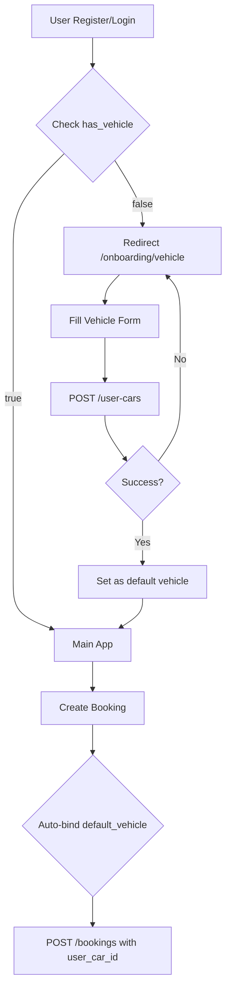
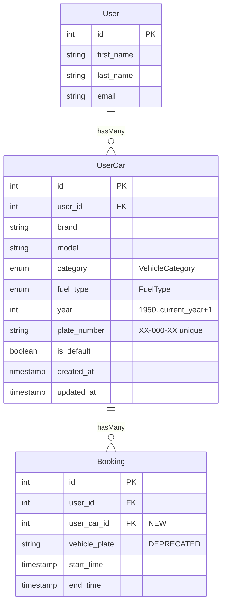
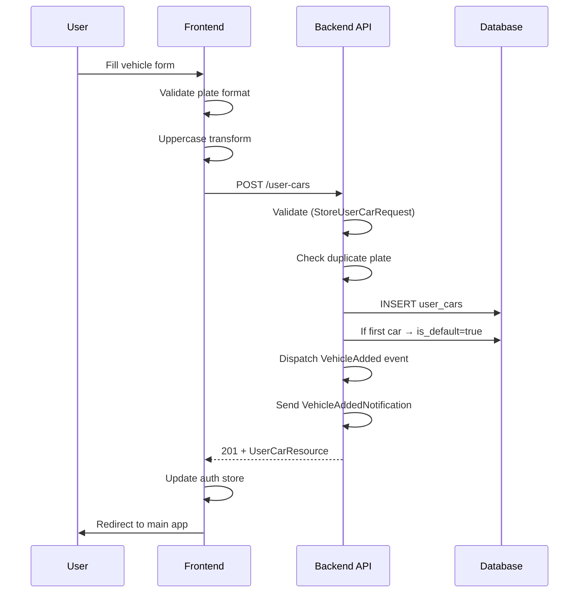
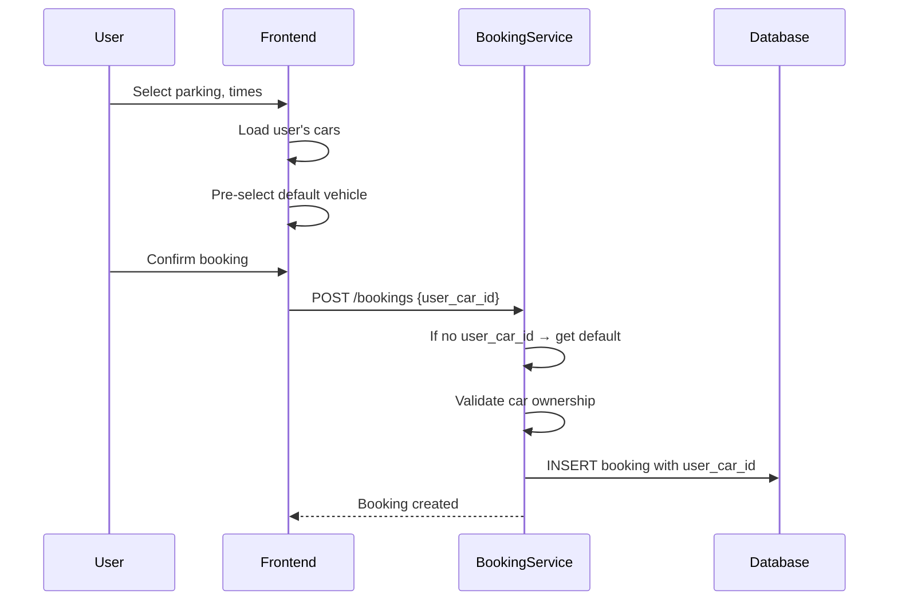

# User Cars Management — Implementation Plan

## Overview
Add full **User Vehicle Management** functionality to GeoPark. After registration/login, users **must** add at least one vehicle before accessing core features (booking, offers, etc.).

---

## Architecture





---

## Phase 1: Backend — Database & Enums

### 1.1 Migration: `create_user_cars_table.php`

**File:** [`backend/database/migrations/2026_05_09_000001_create_user_cars_table.php`](backend/database/migrations/2026_05_09_000001_create_user_cars_table.php)

```php
Schema::create('user_cars', function (Blueprint $table) {
    $table->id();
    $table->foreignId('user_id')->constrained()->cascadeOnDelete();
    $table->string('brand', 100);
    $table->string('model', 100);
    $table->string('category', 50);         // VehicleCategory enum value
    $table->string('fuel_type', 50);        // FuelType enum value
    $table->unsignedSmallInteger('year');
    $table->string('plate_number', 20)->unique();
    $table->boolean('is_default')->default(false);
    $table->timestamps();

    $table->index('user_id');
    $table->index('plate_number');
    $table->index('category');
    $table->index('fuel_type');
});
```

**Year constraint (MySQL raw):** Add `CHECK (year >= 1950 AND year <= YEAR(CURDATE()) + 1)` via raw statement.

For SQLite (dev): `$table->integer('year')` — constraint handled in validation layer.

### 1.2 Migration: `add_user_car_id_to_bookings.php`

**File:** [`backend/database/migrations/2026_05_09_000002_add_user_car_id_to_bookings.php`](backend/database/migrations/2026_05_09_000002_add_user_car_id_to_bookings.php)

```php
Schema::table('bookings', function (Blueprint $table) {
    $table->foreignId('user_car_id')
        ->nullable()
        ->after('user_id')
        ->constrained('user_cars')
        ->nullOnDelete();
});
```

**Note:** `vehicle_plate` stays as nullable legacy field for backward compatibility.

### 1.3 Enum: `VehicleCategory.php`

**File:** [`backend/app/Enums/VehicleCategory.php`](backend/app/Enums/VehicleCategory.php)

```php
enum VehicleCategory: string
{
    case Sedan = 'sedan';
    case Suv = 'suv';
    case Coupe = 'coupe';
    case Hatchback = 'hatchback';
    case Universal = 'universal';
    case Pickup = 'pickup';
    case Minivan = 'minivan';
    case Van = 'van';
    case Cabrio = 'cabrio';
    case Sport = 'sport';
    case Electric = 'electric';
    case Hybrid = 'hybrid';
    case Motorcycle = 'motorcycle';
    case Truck = 'truck';

    public function label(): string { ... }
    public static function values(): array { ... }
}
```

### 1.4 Enum: `FuelType.php`

**File:** [`backend/app/Enums/FuelType.php`](backend/app/Enums/FuelType.php)

```php
enum FuelType: string
{
    case Petrol = 'petrol';
    case Diesel = 'diesel';
    case Hybrid = 'hybrid';
    case Electric = 'electric';
    case Gas = 'gas';
    case PluginHybrid = 'plugin_hybrid';

    public function label(): string { ... }
    public static function values(): array { ... }
}
```

---

## Phase 2: Backend — Model, Service, Controller, Resources

### 2.1 Model: `UserCar.php`

**File:** [`backend/app/Models/UserCar.php`](backend/app/Models/UserCar.php)

- `$fillable`: `user_id, brand, model, category, fuel_type, year, plate_number, is_default`
- `$casts`: `category => VehicleCategory::class, fuel_type => FuelType::class, is_default => boolean, year => integer`
- Relationships:
  - `user()` — `belongsTo(User::class)`
  - `bookings()` — `hasMany(Booking::class)`
- Scopes:
  - `scopeDefault($query)` — `where('is_default', true)`
  - `scopeByUser($query, $userId)` — `where('user_id', $userId)`
  - `scopeByCategory($query, $category)` — filter
  - `scopeByFuelType($query, $fuelType)` — filter
- Method: `setAsDefault()` — sets `is_default=true` for this car, `false` for all others of same user

### 2.2 Model: `User.php` — Add Relationship

Add to [`backend/app/Models/User.php`](backend/app/Models/User.php):

```php
public function cars()
{
    return $this->hasMany(UserCar::class);
}

public function defaultCar()
{
    return $this->hasOne(UserCar::class)->where('is_default', true);
}

public function hasVehicle(): bool
{
    return $this->cars()->exists();
}
```

### 2.3 Model: `Booking.php` — Add Relationship

Add to [`backend/app/Models/Booking.php`](backend/app/Models/Booking.php):

```php
public function userCar()
{
    return $this->belongsTo(UserCar::class);
}
```

### 2.4 Resource: `UserCarResource.php`

**File:** [`backend/app/Http/Resources/UserCarResource.php`](backend/app/Http/Resources/UserCarResource.php)

```php
return [
    'id' => $this->id,
    'user_id' => $this->user_id,
    'brand' => $this->brand,
    'model' => $this->model,
    'category' => $this->category?->value,
    'category_label' => $this->category?->label(),
    'fuel_type' => $this->fuel_type?->value,
    'fuel_type_label' => $this->fuel_type?->label(),
    'year' => $this->year,
    'plate_number' => $this->plate_number,
    'is_default' => $this->is_default,
    'created_at' => $this->created_at?->toIso8601String(),
    'updated_at' => $this->updated_at?->toIso8601String(),
];
```

### 2.5 Resource: `UserResource.php` — Extend

Add to [`backend/app/Http/Resources/UserResource.php`](backend/app/Http/Resources/UserResource.php):

```php
'has_vehicle' => $this->hasVehicle(),
'default_vehicle' => new UserCarResource($this->whenLoaded('defaultCar')),
'cars_count' => $this->when($this->isRegularUser(), fn() => $this->cars()->count()),
```

### 2.6 Resource: `BookingResource.php` — Extend

Add to [`backend/app/Http/Resources/BookingResource.php`](backend/app/Http/Resources/BookingResource.php):

```php
'user_car_id' => $this->user_car_id,
'user_car' => new UserCarResource($this->whenLoaded('userCar')),
```

### 2.7 Service: `UserCarService.php`

**File:** [`backend/app/Services/UserCar/UserCarService.php`](backend/app/Services/UserCar/UserCarService.php)

Methods:
- `getAll(User $user, array $filters = [], int $perPage = 15)` — user's cars with filter/sort/pagination
- `getById(User $user, int $id)` — single car with ownership check
- `create(User $user, array $data)` — create car; if first car, auto-set `is_default=true`
- `update(User $user, UserCar $car, array $data)` — update fields
- `delete(User $user, UserCar $car)` — delete; if was default, assign default to another car (if exists)
- `setDefault(User $user, UserCar $car)` — set as default, unset others

Logic:
- On `create`: if user has no existing cars → `is_default = true`
- On `delete` of default car: pick the most recent remaining car as new default
- Plate number uniqueness enforced at DB level + validation

### 2.8 Controller: `UserCarController.php`

**File:** [`backend/app/Http/Controllers/API/UserCarController.php`](backend/app/Http/Controllers/API/UserCarController.php)

Uses `ApiResponse` trait + DI `UserCarService`.

| Method | Endpoint | Description |
|--------|----------|-------------|
| `index` | `GET /user-cars` | List user's cars (paginated, filterable) |
| `store` | `POST /user-cars` | Create car |
| `show` | `GET /user-cars/{id}` | Get single car |
| `update` | `PUT /user-cars/{id}` | Update car |
| `destroy` | `DELETE /user-cars/{id}` | Delete car |
| `setDefault` | `POST /user-cars/{id}/set-default` | Set as default |

All methods call `$this->authorize('view/update/delete', $car)` for policy enforcement.

---

## Phase 3: Backend — Requests, Policies, Routes

### 3.1 Request: `StoreUserCarRequest.php`

**File:** [`backend/app/Http/Requests/UserCar/StoreUserCarRequest.php`](backend/app/Http/Requests/UserCar/StoreUserCarRequest.php)

Rules:
- `brand` — required, string, max:100
- `model` — required, string, max:100
- `category` — required, string, in: VehicleCategory::values()
- `fuel_type` — required, string, in: FuelType::values()
- `year` — required, integer, min:1950, max:current_year+1 (dynamic rule)
- `plate_number` — required, string, regex:/^[A-Z]{2}-[0-9]{3}-[A-Z]{2}$/, unique:user_cars,plate_number
- Custom `after()` hook to convert plate_number to uppercase

### 3.2 Request: `UpdateUserCarRequest.php`

**File:** [`backend/app/Http/Requests/UserCar/UpdateUserCarRequest.php`](backend/app/Http/Requests/UserCar/UpdateUserCarRequest.php)

Same rules as Store, except:
- All fields `sometimes` (optional on update)
- `plate_number` unique check ignores current car ID

### 3.3 Policy: `UserCarPolicy.php`

**File:** [`backend/app/Policies/UserCarPolicy.php`](backend/app/Policies/UserCarPolicy.php)

```php
public function view(User $user, UserCar $car): bool
{
    return $user->id === $car->user_id || $user->isAdmin();
}

public function create(User $user): bool
{
    return true; // any authenticated user can create cars
}

public function update(User $user, UserCar $car): bool
{
    return $user->id === $car->user_id || $user->isAdmin();
}

public function delete(User $user, UserCar $car): bool
{
    return $user->id === $car->user_id || $user->isAdmin();
}
```

Register in [`backend/app/Providers/AuthServiceProvider.php`](backend/bootstrap/app.php) (if using Laravel 11 — check `bootstrap/app.php`).

### 3.4 Routes: Add to `backend/routes/api.php`

Under `auth:sanctum` middleware group (after existing auth routes):

```php
// User Cars
Route::apiResource('user-cars', \App\Http\Controllers\API\UserCarController::class);
Route::post('user-cars/{car}/set-default', [\App\Http\Controllers\API\UserCarController::class, 'setDefault']);
```

NOTE: `apiResource` generates: GET/POST `user-cars`, GET/PUT/DELETE `user-cars/{car}`. Use `Route::model` binding or type-hint `UserCar $car`.

### 3.5 Register Policy in `bootstrap/app.php`

**File:** [`backend/bootstrap/app.php`](backend/bootstrap/app.php)

Add `UserCar::class => UserCarPolicy::class` to the `Gate::policy()` calls or `withPolicies()` array.

---

## Phase 4: Backend — Events & Notifications

### 4.1 Event: `VehicleAdded`

**File:** [`backend/app/Events/VehicleAdded.php`](backend/app/Events/VehicleAdded.php)

- Implements `ShouldBroadcast`
- Broadcast on private channel `user.{user_id}`
- Broadcast data: car id, brand, model, plate_number

### 4.2 Event: `VehicleDeleted`

**File:** [`backend/app/Events/VehicleDeleted.php`](backend/app/Events/VehicleDeleted.php)

- Same pattern as VehicleAdded
- Broadcast on `user.{user_id}`
- Broadcast data: car id, brand, plate_number (for UI to remove card)

### 4.3 Notification: `VehicleAddedNotification`

**File:** [`backend/app/Notifications/VehicleAddedNotification.php`](backend/app/Notifications/VehicleAddedNotification.php)

- Implements `ShouldQueue`, `ShouldBroadcast`
- via: `database`, `broadcast`
- toDatabase: `{ type: 'vehicle_added', car_id, brand, model, plate_number, message }`
- toBroadcast: `{ car_id, brand, model, message: 'New vehicle added' }`

### 4.4 Notification: `VehicleDeletedNotification`

**File:** [`backend/app/Notifications/VehicleDeletedNotification.php`](backend/app/Notifications/VehicleDeletedNotification.php)

- Same pattern as VehicleAddedNotification
- type: `vehicle_deleted`

### 4.5 Dispatch in Service

In [`UserCarService`](backend/app/Services/UserCar/UserCarService.php):

- `create()`: dispatch `VehicleAdded` event + send `VehicleAddedNotification`
- `delete()`: dispatch `VehicleDeleted` event + send `VehicleDeletedNotification`

---

## Phase 5: Backend — Booking Integration

### 5.1 DTO: `BookingDTO.php` — Add `userCarId`

**File:** [`backend/app/DTOs/BookingDTO.php`](backend/app/DTOs/BookingDTO.php)

Add `public ?int $userCarId = null` property.

Update `fromRequest()` to include `user_car_id` from request data.

### 5.2 Request: `StoreBookingRequest.php` — Add validation

**File:** [`backend/app/Http/Requests/Booking/StoreBookingRequest.php`](backend/app/Http/Requests/Booking/StoreBookingRequest.php)

Add rule:
```php
'user_car_id' => ['nullable', 'integer', 'exists:user_cars,id'],
```

### 5.3 Service: `BookingService.php` — Auto-bind default vehicle

**File:** [`backend/app/Services/Booking/BookingService.php`](backend/app/Services/Booking/BookingService.php)

In `create()` method, after validation but before creating booking:

```php
// If no user_car_id provided, use default car
if (!$dto->userCarId) {
    $defaultCar = $user->defaultCar;
    if (!$defaultCar) {
        throw ValidationException::withMessages([
            'user_car_id' => ['No default vehicle found. Please add a vehicle first.'],
        ]);
    }
    $dto->userCarId = $defaultCar->id;
}

// Verify ownership of provided car
if ($dto->userCarId) {
    $car = UserCar::find($dto->userCarId);
    if (!$car || $car->user_id !== $user->id) {
        throw ValidationException::withMessages([
            'user_car_id' => ['Invalid vehicle selection.'],
        ]);
    }
}
```

Include `user_car_id` in the booking creation array.

### 5.4 Vehicle Guard Middleware (Optional)

**File:** [`backend/app/Http/Middleware/EnsureUserHasVehicle.php`](backend/app/Http/Middleware/EnsureUserHasVehicle.php)

Check if authenticated user has at least one car. If not, return 403 with redirect hint.

Register as route middleware and apply to booking/offer routes if desired. However, the recommended approach is to check in the **frontend** (auth guard) rather than backend middleware, since users can have 0 cars temporarily.

---

## Phase 6: Backend — Auth/me Integration

### 6.1 Modify `AuthController::me()` to load default car

**File:** [`backend/app/Http/Controllers/API/Auth/AuthController.php`](backend/app/Http/Controllers/API/Auth/AuthController.php)

Currently:
```php
$user = $this->authService->refreshProfile($request->user());
return $this->success(new UserResource($user));
```

`refreshProfile()` does `$user->fresh()->load('roles')`. Add `defaultCar` to the load:

Either in `AuthService::refreshProfile()` or directly in controller:

```php
$user = $this->authService->refreshProfile($request->user());
$user->load('defaultCar');
return $this->success(new UserResource($user));
```

### 6.2 Auth Service update

**File:** [`backend/app/Services/Auth/AuthService.php`](backend/app/Services/Auth/AuthService.php)

```php
public function refreshProfile(User $user): User
{
    return $user->fresh()->load(['roles', 'defaultCar']);
}
```

Also `login()` response should load defaultCar:

```php
'user' => $user->load(['roles', 'defaultCar']),
```

### 6.3 User API Resource generates:

```json
{
  "id": 1,
  "first_name": "...",
  ...
  "has_vehicle": true,
  "default_vehicle": {
    "id": 1,
    "brand": "Toyota",
    "model": "Camry",
    ...
  },
  "cars_count": 2
}
```

---

## Phase 7: Backend — Admin Panel Endpoints

### 7.1 Admin Controller — or separate `Admin/UserCarController`

**Option A** (recommended — follows existing pattern where admin endpoints are in `DashboardController`):

But `DashboardController` is already bloated. Better to create:

**File:** [`backend/app/Http/Controllers/API/Admin/UserCarController.php`](backend/app/Http/Controllers/API/Admin/UserCarController.php)

Endpoints added under `admin` prefix:
```
GET    /admin/user-cars              — List all cars (paginated, filterable)
GET    /admin/user-cars/{id}         — Car detail with user info
DELETE /admin/user-cars/{id}         — Delete car (admin force)
POST   /admin/user-cars/{id}/flag    — Flag suspicious vehicle
```

### 7.2 Routes — Add to admin group

**File:** [`backend/routes/api.php`](backend/routes/api.php)

Under `Route::middleware(['role:admin'])->prefix('admin')`:

```php
Route::get('user-cars', [\App\Http\Controllers\API\Admin\UserCarController::class, 'index']);
Route::get('user-cars/{id}', [\App\Http\Controllers\API\Admin\UserCarController::class, 'show']);
Route::delete('user-cars/{id}', [\App\Http\Controllers\API\Admin\UserCarController::class, 'destroy']);
Route::post('user-cars/{id}/flag', [\App\Http\Controllers\API\Admin\UserCarController::class, 'flag']);
```

---

## Phase 8: User Frontend — Types & Services

### 8.1 Types — Add to `user/src/types/index.ts`

```typescript
export enum VehicleCategory {
  Sedan = 'sedan', Suv = 'suv', Coupe = 'coupe',
  Hatchback = 'hatchback', Universal = 'universal',
  Pickup = 'pickup', Minivan = 'minivan', Van = 'van',
  Cabrio = 'cabrio', Sport = 'sport', Electric = 'electric',
  Hybrid = 'hybrid', Motorcycle = 'motorcycle', Truck = 'truck',
}

export enum FuelType {
  Petrol = 'petrol', Diesel = 'diesel', Hybrid = 'hybrid',
  Electric = 'electric', Gas = 'gas', PluginHybrid = 'plugin_hybrid',
}

export interface UserCar {
  id: number;
  user_id: number;
  brand: string;
  model: string;
  category: VehicleCategory;
  category_label: string;
  fuel_type: FuelType;
  fuel_type_label: string;
  year: number;
  plate_number: string;
  is_default: boolean;
  created_at: string;
  updated_at: string;
}

// Extend User interface:
export interface User {
  // ...existing fields
  has_vehicle?: boolean;
  default_vehicle?: UserCar | null;
  cars_count?: number;
}

// Extend Booking interface:
export interface Booking {
  // ...existing fields
  user_car_id?: number;
  user_car?: UserCar;
}
```

### 8.2 Service — `user/src/services/userCars.ts`

Pattern follows [`user/src/services/booking.ts`](user/src/services/booking.ts):

```typescript
import apiClient from './api';
import type { ApiResponse, UserCar } from '@/types';

export const userCarService = {
  async getAll(): Promise<UserCar[]> { ... },
  async getById(id: number): Promise<UserCar> { ... },
  async create(payload: CreateUserCarPayload): Promise<UserCar> { ... },
  async update(id: number, payload: UpdateUserCarPayload): Promise<UserCar> { ... },
  async delete(id: number): Promise<void> { ... },
  async setDefault(id: number): Promise<UserCar> { ... },
};
```

---

## Phase 9: User Frontend — Onboarding Vehicle Screen

### 9.1 Route: `/onboarding/vehicle`

**File:** [`user/src/app/(onboarding)/vehicle/page.tsx`](user/src/app/(onboarding)/vehicle/page.tsx)

- Full-screen mobile-first onboarding form
- Fields: Brand, Model, Category (select), Fuel Type (select), Year (number input), Plate Number (masked input)
- Plate number input: masked `XX-000-XX` format, auto-uppercase transform in realtime
- Validation inline
- On success: redirect to `/` (main app)
- On skip/cancel: disabled — this is mandatory

### 9.2 Component: `PlateNumberInput.tsx`

**File:** [`user/src/components/vehicle/PlateNumberInput.tsx`](user/src/components/vehicle/PlateNumberInput.tsx)

- Masked input: `[A-Z]{2}-[0-9]{3}-[A-Z]{2}`
- Auto uppercase on input
- Visual mask/separators
- Real-time format validation

### 9.3 Component: `VehicleForm.tsx`

**File:** [`user/src/components/vehicle/VehicleForm.tsx`](user/src/components/vehicle/VehicleForm.tsx)

- Reusable form component used in both onboarding and add/edit flows
- Props: `initialData?`, `onSubmit`, `isLoading`
- Uses `PlateNumberInput` component

---

## Phase 10: User Frontend — My Vehicles Page (Profile)

### 10.1 Route: `/profile/vehicles` or section in `/profile`

**File:** [`user/src/app/profile/vehicles/page.tsx`](user/src/app/profile/vehicles/page.tsx)

OR add a "My Vehicles" section to the existing [`profile/page.tsx`](user/src/app/profile/page.tsx) page.

Features:
- List all user cars as modern vehicle cards
- Each card shows: brand, model, category badge, fuel badge, year, plate number
- Default vehicle highlighted with special badge
- Actions: Edit, Delete, Set as Default
- "Add Vehicle" button

### 10.2 Component: `VehicleCard.tsx`

**File:** [`user/src/components/vehicle/VehicleCard.tsx`](user/src/components/vehicle/VehicleCard.tsx)

- Modern card UI
- Category badge (color-coded)
- Fuel badge
- Default vehicle highlight (border/glow)
- Edit/Delete buttons
- Set Default button (if not already default)

### 10.3 Component: `VehicleModal.tsx` (Add/Edit)

**File:** [`user/src/components/vehicle/VehicleModal.tsx`](user/src/components/vehicle/VehicleModal.tsx)

- Modal/Sheet for adding or editing a vehicle
- Uses `VehicleForm` component
- Validates plate number format
- Loading/error states

### 10.4 Component: `DeleteVehicleDialog.tsx`

**File:** [`user/src/components/vehicle/DeleteVehicleDialog.tsx`](user/src/components/vehicle/DeleteVehicleDialog.tsx)

- Confirmation dialog
- Warning if deleting default vehicle (will auto-assign another)
- Loading state during deletion

---

## Phase 11: User Frontend — Booking Integration

### 11.1 Vehicle Selection in Booking Form

**File:** [`user/src/app/booking/page.tsx`](user/src/app/booking/page.tsx)

Modify the booking creation flow:

1. Load user's cars via `userCarService.getAll()` or from auth store
2. Pre-select default vehicle
3. Add a vehicle selector dropdown in the booking form (replaces or supplements `vehicle_plate` text input)
4. On submit, send `user_car_id` instead of (or alongside) `vehicle_plate`

### 11.2 Create Booking Payload

```typescript
export interface CreateBookingPayload {
  parking_id: number;
  start_time: string;
  end_time: string;
  user_car_id?: number;
  notes?: string;
}
```

---

## Phase 12: User Frontend — Auth Guard (Redirect if no vehicle)

### 12.1 Global Auth Guard

**File:** [`user/src/app/layout.tsx`](user/src/app/layout.tsx) or [`user/src/components/Providers.tsx`](user/src/components/Providers.tsx)

After authentication is initialized and user data is loaded:

```typescript
// In a higher-order component or route guard
if (user && user.has_vehicle === false && !onOnboardingPage) {
  router.push('/onboarding/vehicle');
}
```

### 12.2 Exclude Onboarding Route from Guard

The `/onboarding/vehicle` route itself must NOT redirect. Create a route group `(onboarding)` without the guard.

### 12.3 Blocked Actions

If `has_vehicle === false`:
- `POST /bookings` — blocked (backend returns 422 "No default vehicle")
- `POST /offers` — blocked
- Any "Create" action — blocked

The frontend should also disable booking/offer CTAs with a tooltip: "Please add a vehicle first"

---

## Phase 13: Admin Frontend — Types & Services

### 13.1 Types — Add to `admin/src/types/index.ts`

```typescript
export interface UserCar {
  id: number;
  user_id: number;
  user?: User;
  brand: string;
  model: string;
  category: string;
  category_label: string;
  fuel_type: string;
  fuel_type_label: string;
  year: number;
  plate_number: string;
  is_default: boolean;
  created_at: string;
  updated_at: string;
  flagged?: boolean;
}
```

### 13.2 Service — Add to `admin/src/services/api.ts`

Following the existing [`api` object pattern](admin/src/services/api.ts):

```typescript
// Inside the `api` object:
userCars: {
  list: (params?: Record<string, unknown>) => apiClient.get('/admin/user-cars', { params }),
  get: (id: number) => apiClient.get(`/admin/user-cars/${id}`),
  delete: (id: number) => apiClient.delete(`/admin/user-cars/${id}`),
  flag: (id: number) => apiClient.post(`/admin/user-cars/${id}/flag`),
},
```

---

## Phase 14: Admin Frontend — User Cars Page

### 14.1 Route: `/admin/user-cars`

**File:** [`admin/src/app/user-cars/page.tsx`](admin/src/app/user-cars/page.tsx)

Features:
- Data table with columns: ID, User, Brand, Model, Category, Fuel, Year, Plate Number, Created At
- Search by plate number
- Filter by category (dropdown)
- Filter by fuel type (dropdown)
- Filter by user (searchable user select)
- Vehicle details modal (view full information)
- Delete action with confirmation
- Flag suspicious vehicle action

### 14.2 Component: `UserCarsTable.tsx`

**File:** [`admin/src/components/tables/UserCarsTable.tsx`](admin/src/components/tables/UserCarsTable.tsx)

- Reuse the existing [`DataTable`](admin/src/components/tables/data-table.tsx) component pattern
- Custom columns with badges for category/fuel type

---

## Phase 15: Admin Frontend — Sidebar Menu Item

### 15.1 Add to navigation

**File:** [`admin/src/components/layout/sidebar.tsx`](admin/src/components/layout/sidebar.tsx)

Add new nav item:
```typescript
{ label: 'User Cars', href: '/user-cars', icon: Car },
```

The `Car` icon is already imported from `lucide-react` (line 8).

---

## Phase 16: Tests

### 16.1 Backend Tests

**File:** [`backend/tests/Feature/UserCarTest.php`](backend/tests/Feature/UserCarTest.php)

Test cases:
1. **Validation tests:**
   - Plate number regex: `AB-123-CD` passes, `AB123CD` fails, `ab-123-cd` fails
   - Year: 1950 passes, 1949 fails, current_year+1 passes, current_year+2 fails
   - Required fields missing return 422
   - Duplicate plate number returns 422

2. **Policy tests:**
   - Owner can CRUD own car
   - Other user cannot access another's car
   - Admin can access any car

3. **Auth restriction tests:**
   - Unauthenticated requests return 401
   - Sanctum token required

4. **Booking integration tests:**
   - Booking without `user_car_id` auto-binds default car
   - Booking with invalid `user_car_id` returns 422
   - Booking with another user's car returns 403/422
   - Can't create booking if user has no cars

5. **Duplicate plate tests:**
   - Second user can't use same plate
   - Same user can't add same plate twice

6. **Set default tests:**
   - Setting default un-sets others
   - First car auto-becomes default
   - Deleting default auto-assigns another

### 16.2 PHPUnit Config

Ensure `phpunit.xml` has the test suite configured.

---

## Phase 17: Migrations — Safe Production

### 17.1 Safety Measures

- `create_user_cars_table`: Standard create — safe
- `add_user_car_id_to_bookings`:
  - `nullable()` — existing bookings get `NULL`, no data loss
  - `foreignId()->constrained('user_cars')->nullOnDelete()` — if a car is deleted, bookings keep the ID as `NULL`, no cascade
  - Add after `user_id` column to maintain logical order

### 17.2 Rollback Plan

Each migration has a `down()` method:
- Drop `user_cars` table (cascades to drop FK on bookings)
- Remove `user_car_id` column from bookings

---

## File Change Summary

### New Files — Backend (11 files)
| File | Purpose |
|------|---------|
| `backend/app/Enums/VehicleCategory.php` | Vehicle categories enum |
| `backend/app/Enums/FuelType.php` | Fuel types enum |
| `backend/app/Models/UserCar.php` | UserCar model |
| `backend/app/Http/Resources/UserCarResource.php` | API resource |
| `backend/app/Services/UserCar/UserCarService.php` | Business logic |
| `backend/app/Http/Controllers/API/UserCarController.php` | User-facing CRUD |
| `backend/app/Http/Controllers/API/Admin/UserCarController.php` | Admin CRUD |
| `backend/app/Http/Requests/UserCar/StoreUserCarRequest.php` | Create validation |
| `backend/app/Http/Requests/UserCar/UpdateUserCarRequest.php` | Update validation |
| `backend/app/Policies/UserCarPolicy.php` | Authorization |
| `backend/app/Events/VehicleAdded.php` | Broadcast event |
| `backend/app/Events/VehicleDeleted.php` | Broadcast event |
| `backend/app/Notifications/VehicleAddedNotification.php` | DB + broadcast notification |
| `backend/app/Notifications/VehicleDeletedNotification.php` | DB + broadcast notification |
| `backend/database/migrations/2026_05_09_000001_create_user_cars_table.php` | Migration |
| `backend/database/migrations/2026_05_09_000002_add_user_car_id_to_bookings.php` | Migration |

### Modified Files — Backend (6 files)
| File | Changes |
|------|---------|
| `backend/app/Models/User.php` | Add `cars()`, `defaultCar()`, `hasVehicle()` |
| `backend/app/Models/Booking.php` | Add `userCar()` relationship |
| `backend/app/Http/Resources/UserResource.php` | Add `has_vehicle`, `default_vehicle`, `cars_count` |
| `backend/app/Http/Resources/BookingResource.php` | Add `user_car_id`, `user_car` |
| `backend/app/DTOs/BookingDTO.php` | Add `userCarId` |
| `backend/app/Http/Requests/Booking/StoreBookingRequest.php` | Add `user_car_id` validation |
| `backend/app/Services/Booking/BookingService.php` | Auto-bind default car |
| `backend/app/Services/Auth/AuthService.php` | Load `defaultCar` |
| `backend/bootstrap/app.php` | Register policy |
| `backend/routes/api.php` | Add user-cars + admin/user-cars routes |

### New Files — User Frontend (6 files)
| File | Purpose |
|------|---------|
| `user/src/services/userCars.ts` | API service |
| `user/src/app/(onboarding)/vehicle/page.tsx` | Onboarding screen |
| `user/src/components/vehicle/VehicleForm.tsx` | Reusable form |
| `user/src/components/vehicle/VehicleCard.tsx` | Vehicle card component |
| `user/src/components/vehicle/VehicleModal.tsx` | Add/Edit modal |
| `user/src/components/vehicle/DeleteVehicleDialog.tsx` | Delete confirmation |
| `user/src/components/vehicle/PlateNumberInput.tsx` | Masked plate input |

### Modified Files — User Frontend (5 files)
| File | Changes |
|------|---------|
| `user/src/types/index.ts` | Add `UserCar`, `VehicleCategory`, `FuelType` types; extend `User`, `Booking` |
| `user/src/app/profile/page.tsx` | Add "My Vehicles" section |
| `user/src/app/booking/page.tsx` | Add vehicle selector |
| `user/src/components/Providers.tsx` or `layout.tsx` | Add vehicle check guard |
| `user/src/store/authStore.ts` | Optionally cache `has_vehicle`/`default_vehicle` |

### New Files — Admin Frontend (1 file)
| File | Purpose |
|------|---------|
| `admin/src/app/user-cars/page.tsx` | User Cars management page |

### Modified Files — Admin Frontend (3 files)
| File | Changes |
|------|---------|
| `admin/src/types/index.ts` | Add `UserCar` type |
| `admin/src/services/api.ts` | Add `userCars` API methods |
| `admin/src/components/layout/sidebar.tsx` | Add "User Cars" nav item |

---

## Data Flow Diagrams

### Vehicle Creation Flow


### Booking with Vehicle Flow


---

## Order of Implementation

This is the recommended implementation order to minimize conflicts:

1. **Phase 1:** Enums + Migration (safe to run first)
2. **Phase 2:** Model + Resource + Service + Controller
3. **Phase 3:** Requests + Policy + Routes
4. **Phase 4:** Events + Notifications
5. **Phase 5:** Booking integration (depends on model being ready)
6. **Phase 6:** Auth/me integration (depends on UserCar model + User relationship)
7. **Phase 7:** Admin backend endpoints
8. **Phase 8:** User frontend types + services
9. **Phase 9:** Onboarding screen
10. **Phase 10:** My Vehicles page
11. **Phase 11:** Booking integration in frontend
12. **Phase 12:** Auth guard
13. **Phase 13-15:** Admin frontend
14. **Phase 16:** Tests
